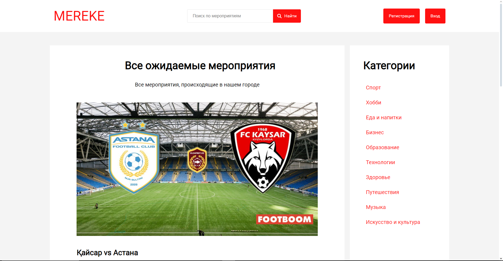
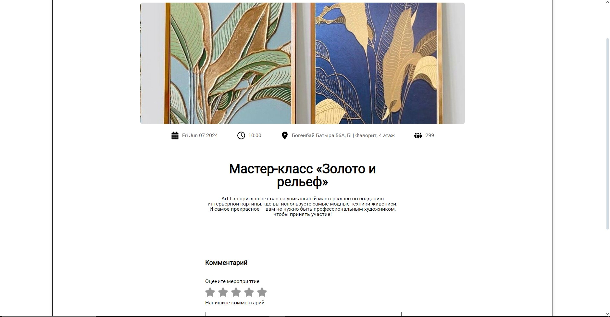
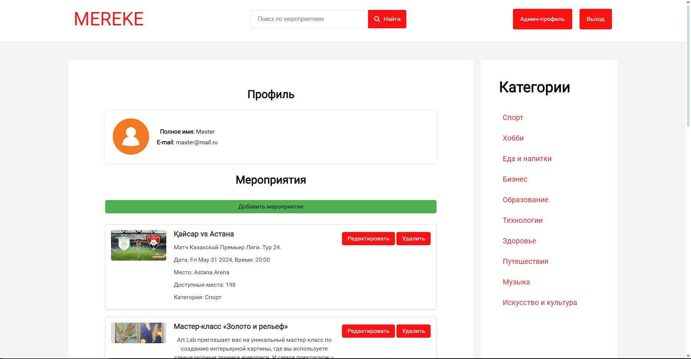
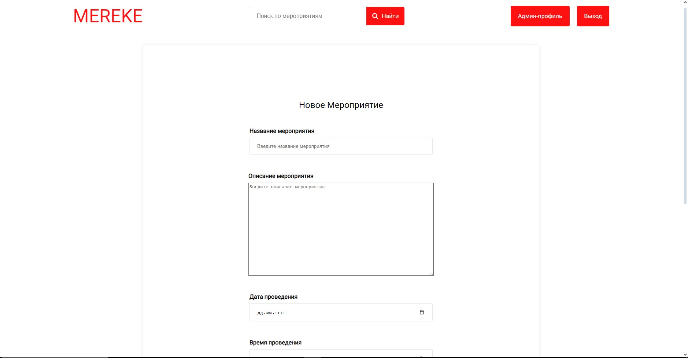
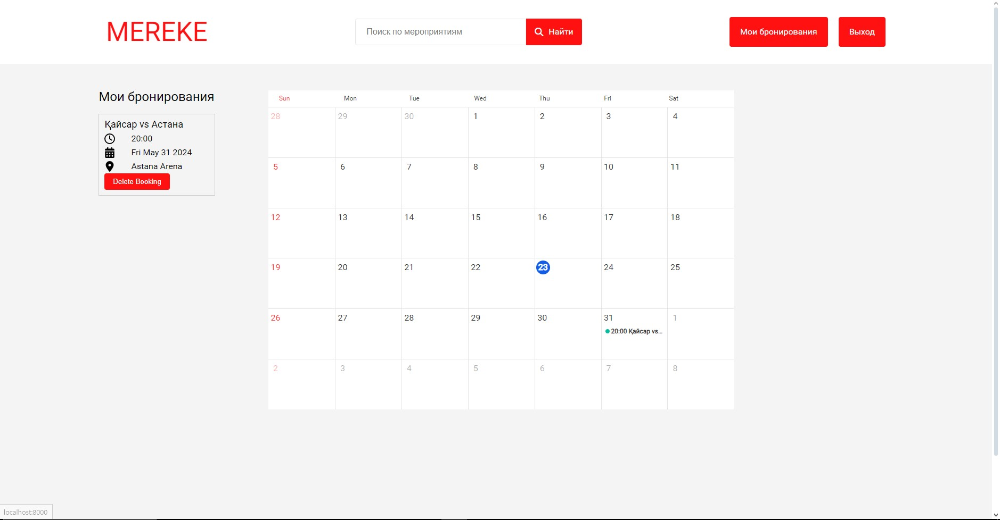

## Установка

Для установки и запуска приложения выполните следующие шаги:

2. Клонирование репозитория с GitHub:

   ```bash
   git clone https://github.com/9ani/Mereke.git
   cd Mereke
   ```

3. Установка зависимостей:

   ```bash
   npm install
   ```

4. Запуск приложения:

   ```bash
   npm start
   ```

## Данные Админа
- Admin username: master@mail.ru
- Admin password: 1

Для дополнительной информации посетите репозиторий проекта на [GitHub](https://github.com/9ani/Mereke).

# Проектирование и разработка

## Методология

В процессе разработки была использована гибкая методология, позволяющая быстро реагировать на изменения требований и добавлять новый функционал по мере необходимости.

## Технологии

### Frontend

В качестве фронтенд-технологий были использованы HTML, CSS и JavaScript, а также EJS для построения пользовательского интерфейса.

### Backend

На бекенде был использован Node.js с фреймворком Express для создания RESTful API, а в качестве базы данных была выбрана MongoDB.

### База данных

Для управления данными приложения была использована MongoDB, а для взаимодействия с базой данных - библиотека Mongoose.

## Уникальные подходы

- **Компонентная архитектура**: Фронтенд приложения был разделен на множество компонентов для повышения читаемости кода, улучшения его структурированности и облегчения поддержки.
- **Асинхронное программирование**: В проекте широко использовались промисы и асинхронные функции для обработки асинхронных операций, таких как запросы к базе данных и обработка HTTP-запросов.

## Компромиссы и проблемы

- **Кросс-браузерная совместимость**: В связи с различиями в реализации стандартов в разных браузерах, некоторые части приложения могут неправильно отображаться или работать не так, как ожидается, в определенных браузерах.
- **Отсутствие тестирования**: Из-за ограниченного времени разработки не были написаны достаточное количество тестов, что может привести к возникновению ошибок или непредвиденному поведению приложения.

## Административная панель

Для управления мероприятиями добавлена административная панель, где администратор может выполнять следующие действия:

- Добавление новых мероприятий.
- Изменение существующих мероприятий.
- Удаление мероприятий.

## Скриншоты

### Скриншот главной страницы


### Детальной страницы

### Скриншот административной панели


### Скриншот добавления мероприятий



### Скриншот страницы брони пользователя


